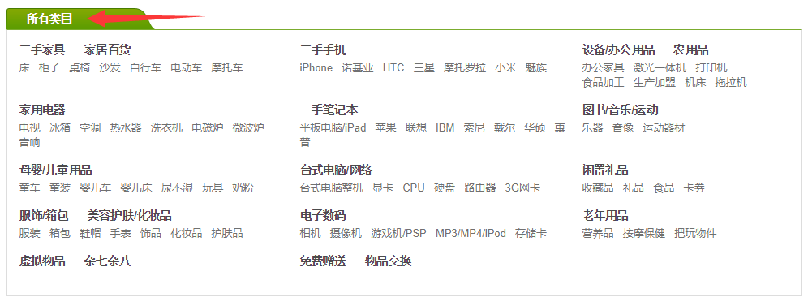
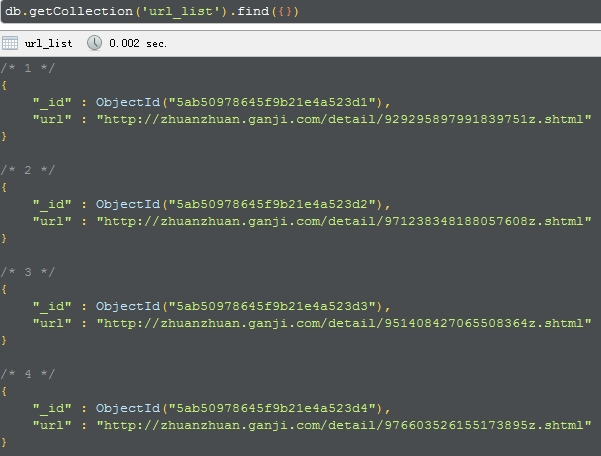
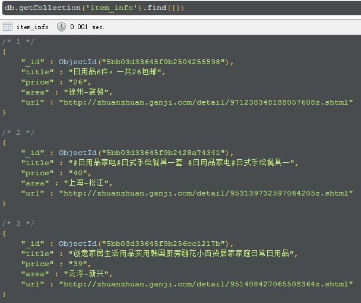

爬取赶集网转转平台所有分类下二手商品的信息 
===========================
   
### 赶集网 - http://bj.ganji.com/wu/ (以北京地区为例)
|Author|:sunglasses:Henryhaohao:sunglasses:|
|---|---
|Email|:hearts:1073064953@qq.com:hearts:

      
****
## :dolphin:声明
### 软件均仅用于学习交流，请勿用于任何商业用途！感谢大家！
## :dolphin:介绍
### 该项目为爬取[赶集网转转](http://bj.ganji.com/wu/)平台所有分类下二手商品的信息(以北京地区为例)
- 爬虫文件:Spiders目录下的4个python文件
- 运行方法:运行Spiders目录下的main.py,先单独运行process_one()生成url_list(获取某个分类下所有页面的商品的详情页URL),再单独运行process_two()生成item_list(获取商品的详情信息)
## :dolphin:运行环境
Version: Python3
## :dolphin:安装依赖库
```
pip3 install -r requirements.txt
```
## :dolphin:**运行截图**
> - **查看赶集网转转平台二手商品的所有分类 - http://bj.ganji.com/wu/**<br><br>



> - **爬取内容**<br><br>


> - **运行过程**<br><br>


> - **数据结构**<br><br>




